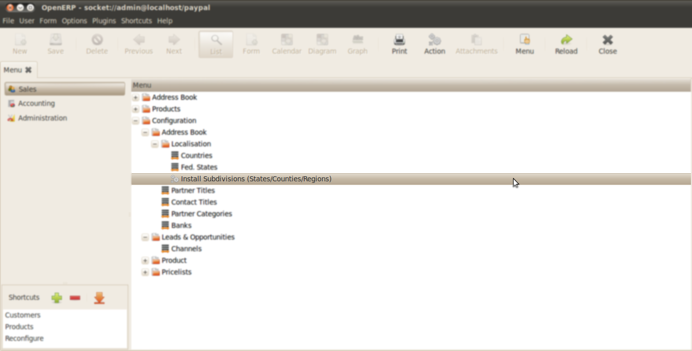
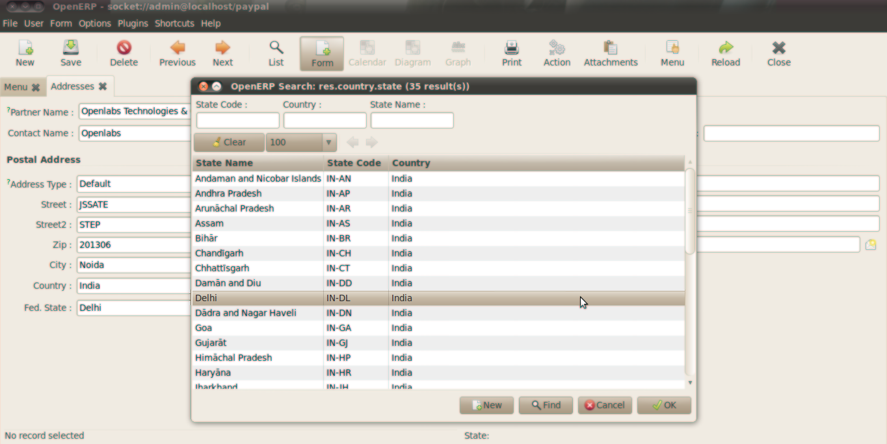

========
Country
========
*OpenERP* provides the list of countries and currencies. But it does not provide
the list of States/Country/Subdivisions.

.. note::

   States, Countries, Subdivisions, Fed State etc. are referred as Subdivision(s)
   in the whole document.

Installation
------------

Country module is dependent on PyCountry. To install this dependency,
type the following command on terminal:

``sudo easy_install pycountry``

.. note::

   Make sure Python-SetupTools and Build-Essentials are already installed.

Using Conutry Module
--------------------

After installing the module `Country`, the list of Subdivisions can be installed
by following these steps:

1. Go to *Sales >> Configuration >> Address Book >> Localisation >>
Install Subdivisions (States/Counties/Subdivisions)*
 

 
2. This will open a wizard. Now choose the country from the drop down menu and
click on Install New Country
 
.. image:: _images/Screenshot-1.png
    :width: 1000
    
3. This will install the subdivisions of the country selected. Here we have
selected the country India and all the subdivisions of India have been
installed.
 
.. image:: _images/Screenshot-2.png
    :width: 1000
    
4. The above installed subdivisions can be used in defining the complete
address of partner under the field Fed. State.
 

